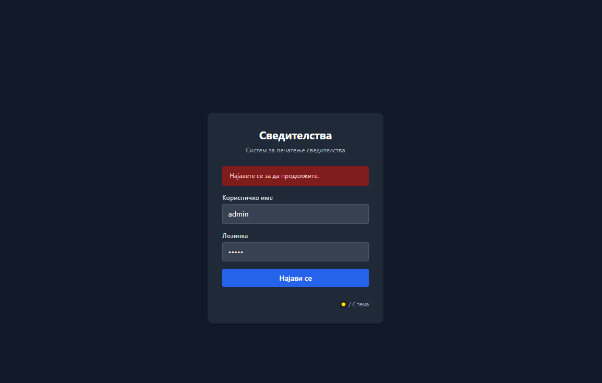
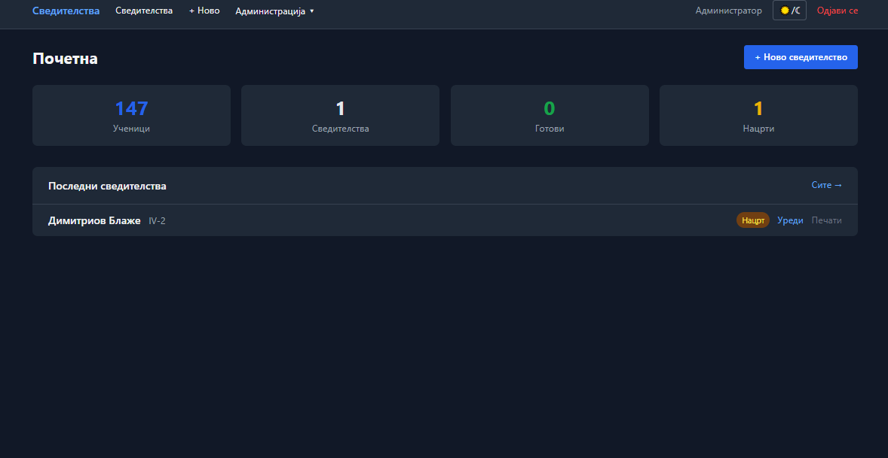
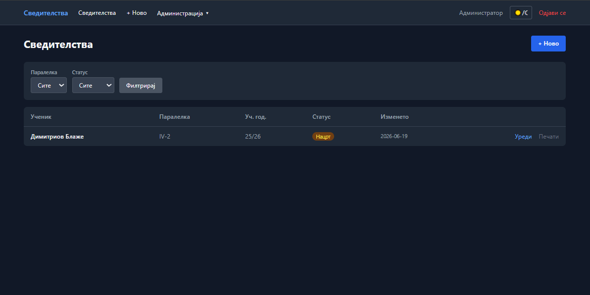

# Свидетелства

Веб апликација за пополнување и печатење на свидетелства (Образец бр. 20) за средни училишта во Република Северна Македонија.

---

## Слики

| Најава | Почетен екран | Свидетелство |
|--------|---------------|--------------|
|  |  |  |

---

## Барања

| Софтвер | Верзија |
|---------|---------|
| Python  | 3.10 или понова |
| pip     | (доаѓа со Python) |

Нема потреба од интернет конекција по инсталацијата. Базата е SQLite — не треба посебен сервер за база.

---

## Инсталација на Windows

### 1. Инсталирај Python

1. Оди на [https://www.python.org/downloads/](https://www.python.org/downloads/)
2. Преземи ја најновата верзија за Windows (Python 3.x.x)
3. Стартувај го инсталерот
4. **ВАЖНО:** Стави штиклирање на „Add Python to PATH" пред да кликнеш Install

### 2. Преземи ја апликацијата

Копирај ја папката `svidetelstva` на PC-то (на пример на `C:\Svidetelstva\`).

Структурата треба да изгледа вака:
```
C:\Svidetelstva\
└── svidetelstva\
    ├── app.py
    ├── database.py
    ├── requirements.txt
    ├── svidetelstva.db
    ├── templates\
    └── static\
```

### 3. Отвори Command Prompt во папката

Во File Explorer оди во папката `C:\Svidetelstva\svidetelstva\`, потоа во address bar напиши `cmd` и притисни Enter.

### 4. Инсталирај зависности

```
pip install -r requirements.txt
```

### 5. Стартувај ја апликацијата

```
python app.py
```

Ќе видиш порака слична на:
```
* Running on http://0.0.0.0:5000
* Running on http://192.168.x.x:5000
```

### 6. Отвори во пребарувач

На истиот PC: [http://localhost:5000](http://localhost:5000)

На останатите PC-а во мрежата: `http://192.168.x.x:5000` (IP адресата од пораката горе)

### Проблем со Firewall на Windows?

Ако другите PC-а не можат да се поврзат, дозволи го пристапот:

1. Отвори **Windows Defender Firewall**
2. Кликни „Allow an app through firewall"
3. Кликни „Allow another app..." → пронајди го `python.exe`
4. Стави штиклирање на „Private" и кликни OK

Или преку Command Prompt (со администраторски права):
```
netsh advfirewall firewall add rule name="Svidetelstva" dir=in action=allow protocol=TCP localport=5000
```

---

## Инсталација на Linux

### 1. Инсталирај Python (ако не е инсталиран)

**Ubuntu / Debian:**
```bash
sudo apt update
sudo apt install python3 python3-pip
```

**Fedora / RHEL:**
```bash
sudo dnf install python3 python3-pip
```

**Arch Linux:**
```bash
sudo pacman -S python python-pip
```

### 2. Оди во папката на апликацијата

```bash
cd /патека/до/svidetelstva
```

### 3. Инсталирај зависности

```bash
pip3 install -r requirements.txt
```

### 4. Стартувај ја апликацијата

```bash
python3 app.py
```

### 5. Отвори во пребарувач

На истиот PC: [http://localhost:5000](http://localhost:5000)

На останатите PC-а: `http://192.168.x.x:5000`

---

## Автоматско стартување при вклучување на PC (Windows)

Ако сакаш апликацијата да се стартува автоматски:

1. Создади фајл `start_svidetelstva.bat` со следната содржина:
```bat
@echo off
cd C:\Svidetelstva\svidetelstva
python app.py
```

2. Стави ја оваа `.bat` датотека во:
`C:\Users\[твоето ime]\AppData\Roaming\Microsoft\Windows\Start Menu\Programs\Startup`

---

## Прва употреба

При прво стартување автоматски се:
- Креира базата (`svidetelstva.db`) ако не постои
- Додава администраторски корисник
- Додаваат сите паралелки (I-1 до IV-15)

**Стандардни податоци за најава:**

| Поле     | Вредност  |
|----------|-----------|
| Корисник | `admin`   |
| Лозинка  | `admin123` |

**Веднаш по најавата смени ја лозинката преку Администрација → Корисници.**

---

## Поставки по инсталација

Пред да почнеш со внесување свидетелства:

### 1. Основни поставки — Администрација → Поставки
- Назив на средното училиште
- Општина/Град
- Датум на верификациски акт

### 2. Министерства — Администрација → Министерства
Додај ги министерствата со нивните акт броеви. Тие потоа се избираат од dropdown во секое свидетелство и автоматски го пополнуваат акт бројот и полето „Издаден од".

### 3. Ученици — Администрација → Ученици
Увези ги учениците преку Excel (.xlsx) или додај ги рачно.

---

## Увоз на ученици

Во папката `static/download/` се наоѓа Excel шаблон:

- `uchenici_template.csv` — шаблон за увоз на ученици

**Excel колони (точни наслови):**

| Колона | Задолжително |
|--------|-------------|
| `Презиме` | да |
| `Ime` | да |
| `Ime на родител` | не |
| `Паралелка` | не (I-1, I1, I 1 — сите формати работат) |
| `Роден/а на` | не |
| `Место на раѓање` | не |
| `Општина на раѓање` | не |
| `Држава на раѓање` | не (default: Република Северна Македонија) |
| `Државјанство` | не (default: македонско) |

Зачувај го фајлот како `.xlsx` и увези го преку **Администрација → Ученици → Увези Excel**.

Исто така можеш да ги **извезеш** сите ученици во Excel преку копчето „Извези Excel".

---

## Работа со свидетелства

- При избор на ученик, личните податоци (родител, датум на раѓање, место) се пополнуваат автоматски
- Датумските полиња имаат календар за полесно внесување
- При избор на министерство, акт бројот се пополнува автоматски
- Свидетелствата се зачувуваат како „нацрт" или „готово"
- Печатењето се отвора во нов таб — позадината не се испраќа на печатарот

---

## Структура на проектот

```
Svidetelstva/
├── svidetelstva/           # Главна апликација
│   ├── app.py              # Flask апликација и рути
│   ├── database.py         # База и SQL функции
│   ├── requirements.txt    # Python зависности
│   ├── svidetelstva.db     # SQLite база со сите податоци
│   ├── templates/          # HTML шаблони
│   │   ├── admin/          # Администраторски страни
│   │   │   ├── students.html
│   │   │   ├── ministries.html
│   │   │   ├── subjects.html
│   │   │   ├── classes.html
│   │   │   ├── users.html
│   │   │   └── settings.html
│   │   ├── certificate_form.html
│   │   ├── print_preview.html
│   │   └── ...
│   └── static/
│       ├── img/            # Скенирани свидетелства (позадина за печат)
│       └── download/       # Excel шаблони за увоз
└── svidetelstva-o/         # Огледало — идентична копија на svidetelstva/
```

---

## Пристап од мрежата

Апликацијата работи на **порт 5000**. Сите PC-а во училишната мрежа можат да пристапат преку пребарувач без инсталација на ништо.

```
http://[IP на серверскиот PC]:5000
```

За да го дознаеш IP-то на серверскиот PC:
- **Windows:** отвори cmd → напиши `ipconfig` → погледај „IPv4 Address"
- **Linux:** во терминал напиши `ip a` или `hostname -I`
